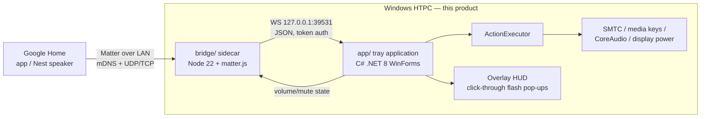

# Blueprint: HTPC Matter Bridge (standalone app)

Technical design for a **fully independent** Windows product: a tray
application that makes the HTPC a locally-paired Google Home device and
executes the resulting commands itself. No dependency on any other repo or app
(see ADR-001). Decisions here are binding until superseded by an ADR.

## 1. Goals & non-goals

**Goals**
- G1: Pair the HTPC with Google Home locally (QR code, no cloud, no Google
  developer ceremony) and control volume/mute/transport/power by voice and
  routines.
- G2: **Self-contained execution** — the app performs every action itself via
  OS facilities (SMTC, media keys, CoreAudio, display power).
- G3: Visible feedback — a click-through overlay HUD flashes each incoming
  command (“Google Home → Volume 40 %”) and the executed action; a tray icon
  reflects bridge state at a glance.
- G4: Reflect real device state (volume %, mute) back into Google Home.
- G5: Survive restarts (persisted Matter fabric credentials) and run unattended.
- G6: Lean: sidecar idle CPU < 0.5 %, sidecar RSS < 80 MB, tray app RSS
  < 40 MB, cold start < 3 s.

**Non-goals**
- Matter Media Playback / Content Launcher clusters (Google doesn't surface
  them — RESEARCH.md). Revisit when Google's supported-clusters page changes.
- Voice recognition of any kind — that is VoiceRemote's domain; the two apps
  are unrelated processes that may coexist on one machine.
- Kodi-aware routing (icebox — would be a fresh implementation here if wanted).
- Ecosystems beyond Google (Alexa/Apple may incidentally pair; untested).

## 2. System design



One owner process: the **tray app** spawns and supervises the sidecar (start
when the bridge is enabled, restart with jittered backoff on crash, stdin
tether so an orphaned sidecar self-terminates, kill on exit).

### 2.1 `bridge/` — Matter sidecar (Node 22, TypeScript)

```
bridge/src/
  index.ts            composition root: config → ipc client → bridge → run
  config.ts           env/args parsing + validation (zod)
  matter/
    bridge.ts         Aggregator endpoint; owns the matter.js ServerNode
    devices.ts        endpoint factories: speaker, momentary switch, toggle
    adapter.ts        THIN wrapper isolating matter.js API churn
  mapping/
    actions.ts        pure fns: cluster writes -> Action msgs (unit-tested)
    state.ts          pure fns: app state -> cluster attribute updates
  ipc/
    client.ts         WS client to the tray app, reconnect w/ backoff, auth
    protocol.ts       message types (versioned contract)
  log.ts              pino, one structured line per event
```

Rules: `matter/` never imports `ipc/`; they meet in `index.ts` through
`mapping/` pure functions. matter.js types stay behind `matter/adapter.ts`.

matter.js facts fixed by integrator research 2026-07-26 (repo is now
`matter-js/matter.js` under the Open Home Foundation):

- Pin `@matter/main@0.17.6`; engines floor is Node **≥ 22.13** (22.0–22.12
  excluded). Never depend on `@matter/nodejs-ble` (native bindings, broken on
  Windows, not needed — the phone/hub does BLE commissioning).
- Confirmed pattern: `ServerNode.create(...)` → `new Endpoint(AggregatorEndpoint)`
  → `aggregator.add(new Endpoint(SpeakerDevice.with(BridgedDeviceBasicInformationServer), {...}))`;
  imports from `@matter/main/devices/*`, `@matter/main/endpoints/aggregator`,
  `@matter/main/behaviors/bridged-device-basic-information`.
- Storage dir set programmatically via `Environment.default.vars.set("storage.path", dir)`
  before `ServerNode.create`.
- Pairing codes: `server.state.commissioning.pairingCodes` (`qrPairingCode`,
  `manualPairingCode`) — only after start, else it throws. **Limitation**: a
  fresh code for adding a second controller post-commissioning is an open
  upstream feature request; our re-pairing story is factory-reset → pair anew.
- Spike-confirmed (S0-3 prep, runs on this machine): attribute-change events
  are `endpoint.events.onOff.onOff$Changed.on(...)` /
  `events.levelControl.currentLevel$Changed.on(...)` (`currentLevel` is
  `number | null`); `uniqueId` must differ from `serialNumber` in every
  BasicInformation block or matter.js warns; set
  `Environment.default.vars.set("runtime.signals", false)` so the app owns
  SIGINT; storage layout under `storage.path` is one dir per node id.
- Node 22 undici quirk (S1-4): a `WebSocket` that fails to connect fires only
  `error`, never `close` — reconnect logic must treat either as terminal for
  the attempt (client.ts guards this; don't assume spec-shaped close events).
- Windows networking: **IPv6 must be enabled** on the NIC (hard matter.js
  requirement even LAN-only); multi-NIC hosts need the mDNS interface pinned —
  config exposes `mdnsInterface` (maps to `mdns.networkInterface`), default
  auto-detect primary LAN adapter. Firewall must allow UDP 5353 + UDP/TCP 5540
  for the sidecar (Defender prompts on first run; documented in user guide).

### 2.2 Matter device model

One **Aggregator (bridge)** node exposing:

| Endpoint | Matter device type | Clusters | Executor action |
|---|---|---|---|
| `HTPC Speaker` | Speaker | OnOff (= mute), LevelControl (0–254 → 0–100 %) | set system volume / mute / unmute |
| `HTPC Play Pause` | On/Off Plug-in Unit (momentary) | OnOff | media play/pause toggle |
| `HTPC Next` | On/Off Plug-in Unit (momentary) | OnOff | next track |
| `HTPC Previous` | On/Off Plug-in Unit (momentary) | OnOff | previous track |
| `HTPC Power` | On/Off Plug-in Unit (stateful) | OnOff | configurable: pause + display off / sleep |

Momentary semantics: an `on` write dispatches the action, then auto-resets to
`off` after 800 ms so voice, app taps, and routines behave as one button press.
Endpoint names are user-configurable — they are the Google voice targets.

### 2.3 IPC protocol (localhost WebSocket, default port 39531)

Bound to `127.0.0.1` only. The tray app generates a random token per session
and passes it to the child via environment variable; the first frame must be a
valid `hello` or the socket closes. One JSON object per message; additive
evolution via `v`, breaking changes bump `protocol` in `hello`.

Sidecar → tray app:
```json
{ "v": 1, "type": "hello", "token": "…", "protocol": 1 }
{ "v": 1, "type": "action", "id": "uuid", "name": "playPause" }
{ "v": 1, "type": "action", "id": "uuid", "name": "setVolume", "value": 40 }
{ "v": 1, "type": "pairing", "qrPayload": "MT:…", "manualCode": "3497-011-2332" }
```

Tray app → sidecar:
```json
{ "v": 1, "type": "ack", "id": "uuid", "ok": true }
{ "v": 1, "type": "state", "volume": 40, "muted": false }
```

State flows on connect and on every change (the executor observes system
volume/mute via CoreAudio callbacks). If the socket is down, Matter writes are
acked, the action is dropped with one WARN, and the bridge never crashes.

### 2.4 `app/` — tray application (C# .NET 8 WinForms, `HtpcMatterBridge`)

```
app/HtpcMatterBridge/
  Program.cs            single-instance mutex, Application.Run(TrayContext)
  TrayContext.cs        tray icon + menu + lifecycle (enable/disable bridge)
  Config.cs             %APPDATA%\HtpcMatterBridge\config.json (camelCase JSON)
  Log.cs                rolling daily file log (7 days)
  Sidecar/
    SidecarSupervisor.cs   spawn node/SEA exe, env token, restart backoff,
                           stdin tether, stdout/stderr → log
    IpcServer.cs           loopback WS server, hello/auth, frame parsing
    Protocol.cs            typed records mirroring bridge/src/ipc/protocol.ts
  Actions/
    ActionExecutor.cs      dispatch: playPause/next/previous/setVolume/mute/power
    MediaKeys.cs           SendInput VK_MEDIA_* scan codes
    SystemVolume.cs        CoreAudio IAudioEndpointVolume (get/set/observe)
    DisplayPower.cs        SC_MONITORPOWER off / SendInput jiggle on
  Ui/
    OverlayHud.cs          click-through, non-activating flash pop-ups:
                           primary line = source + intent ("Google Home → volume 40 %"),
                           pill = executed action/result; updates in place, fades
    PairingWindow.cs       QR code (rendered locally from qrPayload) + manual code
```

- **Tray states**: gray = bridge off · green = paired & connected · amber =
  running, not commissioned (shows "Pair…" menu item) · red = sidecar
  crashed/restarting.
- **Menu**: Enable bridge · Pair with Google Home… · Overlay pop-ups (toggle,
  persisted) · Device names… (opens config) · Open config · Reload config ·
  About · Exit.
- **Overlay HUD**: same UX bar as a good voice-assistant overlay — a single
  persistent, click-through, non-activating window that updates in place and
  fades; flashes on every executed/failed command and on pairing events. All
  text originates as structured input (the parsed command), rendered as the
  "transcribed input" line, with the action pill beneath/next to it.
- **No admin rights**; single instance; optional Start-with-Windows Run key.

House style: mirrors proven WinForms tray-app patterns (XML doc summaries,
`_camelCase` fields, events marshalled to the UI thread via
`SynchronizationContext`, P/Invoke over dependencies) — written fresh here,
zero code imported from other repos.

Concrete native techniques (WS server prefix, CoreAudio interop rules,
SendInput-not-SMTC, message-only window for SC_MONITORPOWER, layered-window
rules, QRCoder as the one NuGet, publish flags) are fixed by **ADR-003** —
Sprint-2 stories implement those choices, they don't reopen them.

### 2.5 Persistence & lifecycle

- Matter fabric/commissioning state: `%APPDATA%\HtpcMatterBridge\matter\`
  (delete = unpair; exposed as "Factory reset bridge" menu action).
- Config + rolling logs under the same appdata root.
- Sidecar stdout is structured (pino) → parsed into the app log with levels.

### 2.6 Packaging

- `bridge/`: Node SEA single exe (`npm run package`) — no Node install for end
  users. Research 2026-07-26: no native addons or worker_threads in the
  `@matter/*` chain, and npm ships esbuild-built CJS (`dist/cjs`) — so the
  route is esbuild-bundle (from CJS output, `--format=cjs --platform=node`)
  → SEA blob → postject, on Node ≥ 22.13. Unproven in the wild: S3-1 smoke-
  tests a real commissioning handshake from the packaged exe first. Fallback
  (no ADR needed, pre-approved): ship official `node.exe` beside the esbuild
  bundle — the tray app launches it either way.
- `app/`: `dotnet publish` self-contained single-file win-x64 (WinForms — no
  trimming), bundling the sidecar exe beside it.
- One dist folder ships both; one `build.ps1` at repo root produces it.

## 3. Riskiest assumptions → Sprint 0 spikes

1. **S0-3**: commissioning the uncertified bridge. Per ADR-002 a Nest hub
   device is required and the test VID/PID must be registered in a free Google
   Home Developer Console project first — the spike validates that recipe on
   real hardware and explicitly verifies the Speaker endpoint's volume UX
   (voice "set … volume to 40 %" + app slider), which Google documents but no
   field report confirms for bridged endpoints.
2. **S0-4**: momentary-switch auto-reset UX (Home app taps register cleanly;
   no debounce weirdness at 800 ms) — plus commission one **Generic Switch**
   endpoint and record how the Home app/routines surface it (ADR-002; Google
   ships native button-press routine triggers since April 2026).
