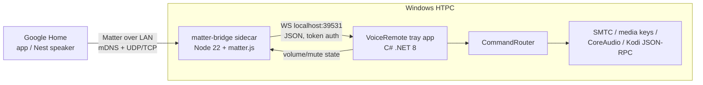

# Blueprint: HTPC Matter Bridge

Technical design for the matter.js sidecar and its integration with VoiceRemote.
Decisions recorded here are binding until superseded by an ADR in `docs/adr/`.

## 1. Goals & non-goals

**Goals**
- G1: Pair the HTPC with Google Home locally (QR code, no cloud) and control
  volume/mute/transport/power by voice and routines.
- G2: Reuse VoiceRemote's `CommandRouter` for every action — one dispatch path
  for voice, tray, and Google Home.
- G3: Reflect real device state (volume %, mute) back into Google Home.
- G4: Survive restarts (persisted Matter fabric credentials) and run unattended.
- G5: Stay lean: sidecar idle CPU < 0.5 %, RSS < 80 MB, cold start < 3 s.

**Non-goals**
- Matter Media Playback / Content Launcher clusters (Google doesn't surface
  them — see RESEARCH.md). Revisit only when Google's docs change.
- Multi-admin ecosystems beyond Google (Alexa/Apple pairing may incidentally
  work — Matter is multi-admin — but is untested and unsupported).
- Running without VoiceRemote (the sidecar is an accessory, not a standalone).

## 2. System design



Two processes, one owner: VoiceRemote **spawns and supervises** the sidecar
(start on "Enable Google Home bridge", restart with backoff on crash, kill on
exit). The sidecar never outlives the tray app.

### 2.1 Module structure (sidecar, `src/`)

```
src/
  index.ts            composition root: config → ipc client → bridge → run
  config.ts           env/file config parsing + validation (zod)
  matter/
    bridge.ts         Aggregator endpoint; owns the matter.js ServerNode
    devices.ts        endpoint factories: speaker, momentary switch, toggle
    adapter.ts        THIN wrapper isolating matter.js API churn from the app
  mapping/
    actions.ts        pure fns: cluster writes -> Action msgs (unit-tested)
    state.ts          pure fns: VoiceRemote state -> cluster attribute updates
  ipc/
    client.ts         WS client to VoiceRemote, reconnect w/ backoff, auth
    protocol.ts       message types (shared contract, versioned)
  log.ts              pino, one line per event, no chatter
```

Rules: `matter/` never imports `ipc/`; both meet only in `index.ts` wiring
through `mapping/` pure functions. matter.js types do not leak past
`matter/adapter.ts`.

### 2.2 Matter device model

One **Aggregator (bridge)** node exposing:

| Endpoint | Matter device type | Clusters | Maps to |
|---|---|---|---|
| `HTPC Speaker` | Speaker | OnOff (= mute), LevelControl (= volume 0–254 → 0–100 %) | `SetVolume` / `Mute` / `Unmute` |
| `HTPC Play Pause` | On/Off Plug-in Unit (momentary) | OnOff | `PlayPause` |
| `HTPC Next` | On/Off Plug-in Unit (momentary) | OnOff | `Next` |
| `HTPC Previous` | On/Off Plug-in Unit (momentary) | OnOff | `Previous` |
| `HTPC Power` | On/Off Plug-in Unit (stateful) | OnOff | configurable: `Pause`+display-off / sleep / close-app |

Momentary semantics: an `on` write dispatches the action then auto-resets the
attribute to `off` after 800 ms, so voice, app taps, and routines all behave as
a single button press. Names are user-configurable (they become the Google
voice targets).

### 2.3 IPC protocol (localhost WebSocket, default port 39531)

- Transport: `ws://127.0.0.1:<port>` — **bound to loopback only**. Auth: the
  supervisor (VoiceRemote) generates a random token per session, passes it to
  the child via environment variable; first frame must be `hello` with the
  token or the socket is closed.
- Framing: one JSON object per message. `v` fields allow additive evolution;
  breaking changes bump the protocol version in `hello`.

Sidecar → VoiceRemote (commands):
```json
{ "v": 1, "type": "hello", "token": "…", "protocol": 1 }
{ "v": 1, "type": "action", "id": "uuid", "name": "playPause" }
{ "v": 1, "type": "action", "id": "uuid", "name": "setVolume", "value": 40 }
{ "v": 1, "type": "action", "id": "uuid", "name": "mute" }
```

VoiceRemote → sidecar (acks + state):
```json
{ "v": 1, "type": "ack", "id": "uuid", "ok": true }
{ "v": 1, "type": "state", "volume": 40, "muted": false }
{ "v": 1, "type": "pairing?", "show": true }   // sidecar asks tray to show QR
```

State flows on connect and on every change (VoiceRemote already observes system
volume for its own commands). If the socket is down, cluster writes fail
gracefully (Matter write acked, action dropped, WARN logged) — never crash.

### 2.4 VoiceRemote-side integration (lives in ../windows-voice-control)

- `Integrations/MatterBridge/` — process supervisor (spawn node/SEA exe,
  restart backoff, env token), WS server-side of the protocol, mapping to
  `CommandRouter.HandleBindingAsync`, state publisher.
- `Config.cs` — `MatterBridgeConfig { Enabled, Port, DeviceNames, SidecarPath,
  StoragePath }`.
- Tray menu — "Google Home bridge" toggle; first-enable shows pairing QR
  (reuse `TranscriptOverlay` pattern or a minimal form; QR payload + manual
  code come from the sidecar's stdout/IPC).

### 2.5 Persistence & lifecycle

- Matter fabric/commissioning state: matter.js storage dir →
  `%APPDATA%\VoiceRemote\matter\` (survives restarts; deleting it = unpair).
- Sidecar logs: pino → stdout, captured by VoiceRemote into its rolling log.
- Clean shutdown on SIGTERM/stdin-close (supervisor closes stdin on exit so an
  orphaned sidecar self-terminates).

### 2.6 Packaging

Ship as **Node SEA (single executable application)** built in CI: no Node
install for end users; the exe sits next to VoiceRemote.exe (~60–80 MB).
Development mode: `npm start` with system Node 22.
Fallback if SEA + matter.js native-free claim hits friction: document a Node 22
prerequisite in Sprint 3 and defer SEA (ADR required).

## 3. Riskiest assumptions → spikes first (see DEVELOPMENT-PLAN)

1. **S0-3**: a Google Home *without* a Nest hub may refuse to commission a
   third-party bridge (border-router/fabric-admin question). Validate with the
   minimal OnOff example on real hardware before any product code.
2. **S0-4**: momentary-switch auto-reset UX in the Home app (no debounce
   weirdness, taps register as presses).
3. Speaker device volume voice-grammar actually resolves ("set HTPC volume to
   40 %") for an uncertified bridged endpoint.
