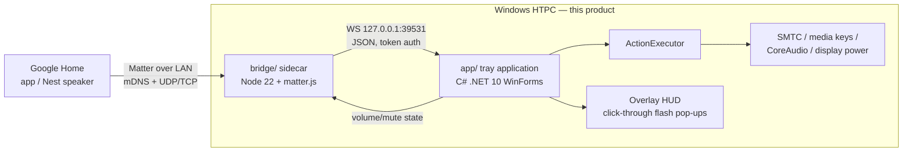

# Blueprint: MatterHelm (standalone app)

Technical design for a **fully independent** Windows product: a tray
application that makes the HTPC a locally-paired Google Home device and
executes the resulting commands itself. No dependency on any other repo or app
(see ADR-001). Decisions here are binding until superseded by an ADR.

## 1. Goals & non-goals

**Goals**
- G1: Pair the HTPC with Google Home locally (QR code, no MatterHelm cloud or
  OAuth service; one-time free Google Home Developer Console registration is
  required) and control volume/mute/transport/power by voice and routines.
- G2: **Self-contained execution** — the app performs every action itself via
  OS facilities (SMTC, media keys, CoreAudio, display power).
- G3: Visible feedback — a click-through overlay HUD uses a static MatterHelm
  header above one command/result or volume pill; a tray icon reflects bridge
  state at a glance.
- G4: Reflect real device state (volume %, mute) back into Google Home.
- G5: Survive restarts (persisted Matter fabric credentials) and run unattended.
- G6: Lean (budgets restated in **ADR-007** from measurements): idle CPU
  < 0.5 % both; tray private ≤ 32 MB; sidecar one process, private ≤ 120 MB;
  cold start < 3 s (bundle: ~1 s). Working set is informational only.

**Non-goals**
- Matter Media Playback / Content Launcher clusters (Google doesn't surface
  them — RESEARCH.md). Revisit when Google's supported-clusters page changes.
- Voice recognition of any kind — "Hey Google" recognition happens on
  Google's devices; this app only receives the resulting Matter commands.
- Kodi-specific JSON-RPC routing. The generic focused-first route supports
  sessionless players such as Kodi, but cannot verify their playback state.
- Ecosystems beyond Google (Alexa/Apple may incidentally pair; untested).

## 2. System design



One supervising process: the **tray app** spawns and supervises the sidecar (start
when the bridge is enabled, restart with jittered backoff on crash, stdin
tether so an orphaned sidecar self-terminates, kill on exit). An unhandled
promise rejection is fatal to the sidecar: it logs once, shuts down with a
non-zero exit, and lets the supervisor's bounded backoff restart it.

### 2.1 `bridge/` — Matter sidecar (Node 22, TypeScript)

```
bridge/src/
  index.ts            composition root: config → ipc client → bridge → run
  config.ts           env/args parsing + validation (zod)
  matter/
    bridge.ts         Aggregator endpoint; owns the matter.js ServerNode
    devices.ts        endpoint factories: speaker and retained/resettable switches
    adapter.ts        THIN wrapper isolating matter.js API churn
  mapping/
    actions.ts        pure fns: observed Speaker state / intercepted plug commands -> Action msgs
    state.ts          pure fns: app state -> cluster attribute updates
  ipc/
    client.ts         `ws` client: auth, fail-closed frames, bounded reconnect
    protocol.ts       message types (versioned contract)
  log.ts              pino, one structured line per event
```

Rules: `matter/` never imports `ipc/`; they meet in `index.ts` through
`mapping/` pure functions. matter.js types stay behind `matter/adapter.ts`.

matter.js facts fixed by integrator research 2026-07-26 (repo is now
`matter-js/matter.js` under the Open Home Foundation):

- Pin `@matter/main@0.17.7` (ADR-006 patch bump); engines floor is Node **≥ 22.13** (22.0–22.12
  excluded). Never depend on `@matter/nodejs-ble` (native bindings, broken on
  Windows, not needed — the phone/hub does BLE commissioning).
- Confirmed pattern: `ServerNode.create(...)` → `new Endpoint(AggregatorEndpoint)`
  → `aggregator.add(new Endpoint(SpeakerDevice.with(BridgedDeviceBasicInformationServer), {...}))`;
  imports from `@matter/main/devices/*`, `@matter/main/endpoints/aggregator`,
  `@matter/main/behaviors/bridged-device-basic-information`.
- Storage dir set programmatically via `Environment.default.vars.set("storage.path", dir)`
  before `ServerNode.create`.
- Pairing codes: `server.state.commissioning.pairingCodes` (`qrPairingCode`,
  `manualPairingCode`) — only after start, else it throws. **Limitation**: a
  fresh code for adding a second controller post-commissioning is an open
  upstream feature request; our re-pairing story is factory-reset → pair anew.
- Spike-confirmed (S0-3 prep, runs on this machine): attribute-change events
  are `endpoint.events.onOff.onOff$Changed.on(...)` /
  `events.levelControl.currentLevel$Changed.on(...)` (`currentLevel` is
  `number | null`); `uniqueId` must differ from `serialNumber` in every
  BasicInformation block or matter.js warns; set
  `Environment.default.vars.set("runtime.signals", false)` so the app owns
  SIGINT; storage layout under `storage.path` is one dir per node id.
- Node 22 undici quirk (S1-4): a `WebSocket` that fails to connect fires only
  `error`, never `close` — reconnect logic must treat either as terminal for
  the attempt (client.ts guards this; don't assume spec-shaped close events).
- Windows networking: **IPv6 must be enabled** on the NIC (hard matter.js
  requirement even LAN-only); multi-NIC hosts need the mDNS interface pinned —
  config exposes `mdnsInterface` (maps to `mdns.networkInterface`), default
  auto-detect primary LAN adapter. Firewall must allow UDP 5353 + UDP/TCP 5540
  for the sidecar (Defender prompts on first run; documented in user guide).

### 2.2 Matter device model

One **Aggregator (bridge)** node exposing the configured subset below. The
names shown are defaults; all built-ins start enabled, and each enabled custom
command adds one more endpoint.

| Endpoint | Matter device type | Clusters | Executor action |
|---|---|---|---|
| `HTPC Speaker` | Speaker | OnOff (On = unmuted, Off = muted), LevelControl (0–254 → 0–100 %) | set system volume / mute / unmute |
| `HTPC Play Pause` | On/Off Plug-in Unit (stateful) | OnOff | On = dedicated play; Off = dedicated pause |
| `HTPC Next` | On/Off Plug-in Unit (stateful) | OnOff | next track on either transition |
| `HTPC Previous` | On/Off Plug-in Unit (stateful) | OnOff | previous track on either transition |
| `HTPC Power` | On/Off Plug-in Unit (stateful or momentary by action) | OnOff | configurable: displays off/on, pause + displays off/on, screensaver start/stop, or sleep |
| Each enabled custom command | On/Off Plug-in Unit (retained by default; optional momentary reset) | OnOff | run its configured app-local action; retained commands receive the actual `on` edge |

Trigger semantics (ADR-008 as amended by ADR-012): every plug endpoint above
dispatches from the **OnOff command** it receives (`On`/`Off`/`Toggle`), not
from the attribute change that command produces. Matter's `onOff` attribute is
read-only, so commands are the complete observation point, including repeated
commands that rewrite the held value. Play/Pause maps On to dedicated Play and
Off to dedicated Pause; Next and Previous fire their same action on either user
transition. Power is stateful for reversible actions: Off engages displays-off,
pause-plus-displays-off, or screensaver, while On wakes the displays or stops
the screensaver. Pause-plus-displays-off never resumes playback on On. Power is
momentary for irreversible actions (currently sleep): only Off dispatches, then
the bridge promptly writes the attribute On locally. That local write invokes
no OnOff command and therefore dispatches nothing. User On also dispatches
nothing in an irreversible mode.

Custom commands use the same retained-state, both-edge behavior by default.
Each custom command may opt into `resetAfterActivation`: only On fires in that
mode, then the bridge writes the attribute Off after
`HTPC_BRIDGE_MOMENTARY_RESET_MS` (0 = next tick). That local attribute write
does not invoke an OnOff command and therefore does not fire the custom action.
No timing-based trailing-Off suppression is used (S10-29 was reverted).
A `sequence` custom action runs its ordered app-local steps once per outer
activation, with no On/Off edge assigned to an individual step. A `mouseMove`
step is therefore a stateless one-shot absolute move to the same preset or
explicit-coordinate targets as the standalone retained mouse command, clamped
to the virtual desktop. It never reads or writes retained capture state and
never restores implicitly; returning the pointer requires another explicit
mouse step. Sequences remain capped at 16 steps and 10 seconds of summed
delays, cannot nest, and stop at the first failing step. Windows does not permit
off-screen parking (measured requests `(5000,5000)` and `(-500,-500)` clamped
to the desktop bounds); corner parking is supported, cursor hiding is not.
A true Matter "tap button" (Generic Switch) exists but Google grants it
routine-trigger grammar only — no direct voice target — so On/Off Plug-in Unit
endpoints remain the controllable transport (research 2026-08).
Endpoint names are user-configurable — they are the Google voice targets.
Play, Pause, and Play/Pause first send a bounded `WM_APPCOMMAND` to the
foreground window. The tray resolves that window's PID, executable/AUMID, and
the current SMTC session's `SourceAppUserModelId`; it may short-circuit or
verify only when those identities belong to the same app. A different-app
session is unverifiable and never receives fallback for a command aimed at a
specific foreground window. An unhandled or failed focused command may fall
back only to that same app's captured session. When no foreground target can
be captured, the captured current session remains the intended fallback.
Every fallback is an absolute `TryPlayAsync`/`TryPauseAsync`
operation (Play/Pause computes the desired state before delivery), pinned to
the captured session identity and covered by one four-second route deadline.
Delivered commands to sessionless players such as Kodi are acknowledged but
logged as unverifiable. An identical dedicated verb immediately repeated to
the same unverifiable foreground process within two seconds is suppressed;
outside that window Kodi's toggle-like Pause remains an explicit limitation. Display
power uses DDC/CI VCP `0xD6` for
each accepting physical monitor. Windows global blanking is used only when no
physical monitor accepts DDC; in a mixed setup unsupported panels are left on.

Speaker state propagation is bounded at both process boundaries. The tray
allows one state send in flight, keeps only the newest state that arrives while
it is sending, and gives each IPC send five seconds. The sidecar serializes
Matter Speaker writes with one coalescing latest-state slot. Its local-write
echo expectations are capped at 32 and expire after five seconds. Delay-bearing
custom-command macros are single-flight per command and globally capped at
eight concurrent macros; excess activations receive a failed acknowledgement.

### 2.3 IPC protocol (localhost WebSocket, default port 39531)

The tray registers the literal `http://localhost:{port}/` HTTP.sys prefix (the
form that needs no URL ACL), but that prefix alone is not admission control:
HTTP.sys can bind the socket on all interfaces. Before the single-client slot
is taken, `IpcServer` checks `RemoteEndPoint`, accepts IPv4/IPv6 loopback only,
and returns HTTP 403 otherwise. The rejection is logged once with the address
family only. The tray app generates a random token per session and passes it to
the child via environment variable; the first frame must be a valid `hello` or
the socket closes.

Environment contract (tray app → sidecar child; fixed here so S1-5 and S2-1
implement the same names):

| Variable | Meaning | Default |
|---|---|---|
| `HTPC_BRIDGE_IPC_PORT` | loopback WS port the tray app listens on | `39531` |
| `HTPC_BRIDGE_IPC_TOKEN` | per-session auth token for `hello` | required, no default |
| `HTPC_BRIDGE_STORAGE_DIR` | matter.js `storage.path` | `%APPDATA%\MatterHelm\matter` |
| `HTPC_BRIDGE_LOG_LEVEL` | pino level | `info` |
| `HTPC_BRIDGE_ENDPOINTS` | JSON endpoint map per **ADR-004/ADR-012** (built-ins with `{name, enabled}`, Power also has `momentary`, plus `custom: [{key, name, resetAfterActivation}]`); missing reset/momentary fields default false | built-in "HTPC …" names, all enabled, reversible Power, no custom |
| `HTPC_BRIDGE_MDNS_INTERFACE` | mDNS interface pin for multi-NIC hosts (maps to matter.js `mdns.networkInterface`) | unset = auto |
| `HTPC_BRIDGE_MOMENTARY_RESET_MS` | opt-in custom-command auto-reset window, integer ms 0–2000 (0 = next-tick reset); invalid = fatal | `0` |
| `HTPC_BRIDGE_NAME` | the bridge's own display name in Google Home (S10-6); blank/unset = `HTPC Matter Bridge` | `HTPC Matter Bridge` |
| `HTPC_BRIDGE_UNIQUE_ID_SEED` | seed for every endpoint's stable identity (ADR-009). Tray app resolves it once: existing fabric → the legacy shared constant (pairing preserved), fresh install → a minted per-install value | unset = legacy constant |
| `HTPC_BRIDGE_VENDOR_ID` | Matter vendor id, decimal or `0x` hex, 1–65535; invalid = fatal (ADR-009) | `0xFFF1` (ADR-002 test VID) |
| `HTPC_BRIDGE_PRODUCT_ID` | Matter product id, decimal or `0x` hex, 1–65535; invalid = fatal (ADR-009) | `0x8000` (ADR-002 test PID) |
| `HTPC_BRIDGE_MATTER_LOG_LEVEL` | matter.js global log level (`debug/info/notice/warn/error/fatal`; ADR-006) | derived from log level (info→`notice`) |
| `HTPC_BRIDGE_MATTER_LOG_FACILITIES` | JSON map matter.js facility→level for targeted debug (e.g. `{"MdnsServer":"debug"}`); malformed = fatal | unset |

The supervisor inherits the parent process environment, so the two matter-log
variables can also be set machine/user-wide for troubleshooting without any
app changes.

The tray's `config.json` is bounded to 1 MiB, 64 custom commands, 64 characters
per endpoint/bridge name, 2048 characters of launch arguments, and 128
characters for `uniqueIdSeed`. Invalid fields produce validation/WARN errors
and safe defaults or dropped entries, not crashes. The sidecar never receives
launch actions or the file itself; it independently revalidates the shared
endpoint count/name and identity-seed limits in its environment contract and
fails startup with a named configuration error if they are invalid.

The token is never logged and never persisted (either side). One strict JSON
object per message: unknown/missing fields or wrong types are rejected.
Additive evolution bumps `v`; breaking changes bump `protocol` in `hello`.
The current message revision is `v: 5` (the custom action's retained `on`
edge is additive); `hello.protocol` remains `1`. UUID fields use canonical RFC 9562
form. Custom keys are lowercase kebab-case slugs, at most 64 characters.

Every row below is a strict object: fields not listed are rejected. Every
frame also carries the literal `v: 5`.

| Direction | Frame/variant | Fields after `v` | Constraints |
|---|---|---|---|
| Sidecar → tray | `hello` | `type:"hello"`, `token`, `protocol:1` | first frame; `token` is a non-empty string |
| Sidecar → tray | bare `action` | `type:"action"`, `id`, `name` | `name` is `playPause`, `play`, `pause`, `next`, `previous`, `powerOn`, or `powerOff`; `id` is a canonical RFC 9562 UUID |
| Sidecar → tray | volume `action` | `type:"action"`, `id`, `name:"setVolume"`, `value` | `value` is an integer `0`–`100` |
| Sidecar → tray | mute `action` | `type:"action"`, `id`, `name:"setMuted"`, `value` | `value` is boolean |
| Sidecar → tray | custom `action` | `type:"action"`, `id`, `name:"custom"`, `key`, `on` | `key` is a lowercase kebab-case slug of at most 64 characters; `on` is boolean |
| Sidecar → tray | `pairing` | `type:"pairing"`, `qrPayload`, `manualCode` | QR payload starts `MT:`; manual code is non-empty |
| Sidecar → tray | `matterStatus` | `type:"matterStatus"`, `commissioned`, `advertisement` | advertisement is `checking`, `visible`, `missing`, or `notApplicable`; commissioned iff `notApplicable` |
| Tray → sidecar | successful `ack` | `type:"ack"`, `id`, `ok:true` | `error` is forbidden |
| Tray → sidecar | failed `ack` | `type:"ack"`, `id`, `ok:false`, optional `error` | `error`, when present, is a string |
| Tray → sidecar | `state` | `type:"state"`, `volume`, `muted` | volume is an integer `0`–`100`; muted is boolean |

Sidecar → tray app:
```json
{ "v": 5, "type": "hello", "token": "…", "protocol": 1 }
{ "v": 5, "type": "action", "id": "00000000-0000-0000-0000-000000000000", "name": "playPause" }
{ "v": 5, "type": "action", "id": "00000000-0000-0000-0000-000000000000", "name": "play" }
{ "v": 5, "type": "action", "id": "00000000-0000-0000-0000-000000000000", "name": "pause" }
{ "v": 5, "type": "action", "id": "00000000-0000-0000-0000-000000000000", "name": "next" }
{ "v": 5, "type": "action", "id": "00000000-0000-0000-0000-000000000000", "name": "previous" }
{ "v": 5, "type": "action", "id": "00000000-0000-0000-0000-000000000000", "name": "powerOn" }
{ "v": 5, "type": "action", "id": "00000000-0000-0000-0000-000000000000", "name": "powerOff" }
{ "v": 5, "type": "action", "id": "00000000-0000-0000-0000-000000000000", "name": "setVolume", "value": 40 }
{ "v": 5, "type": "action", "id": "00000000-0000-0000-0000-000000000000", "name": "setMuted", "value": true }
{ "v": 5, "type": "action", "id": "00000000-0000-0000-0000-000000000000", "name": "custom", "key": "movie-mode", "on": true }
{ "v": 5, "type": "pairing", "qrPayload": "MT:…", "manualCode": "3497-011-2332" }
{ "v": 5, "type": "matterStatus", "commissioned": false, "advertisement": "visible" }
```

`setVolume.value` is an integer 0–100. `setMuted.value` and custom `on` are
boolean. Custom `on` is the actual Matter command edge; the tray uses it for
retained actions such as mouse On=move and Off=restore.
`pairing.qrPayload` starts with `MT:` and `manualCode` is non-empty.
`matterStatus.advertisement` is `checking`, `visible`, `missing`, or
`notApplicable`; commissioned is true exactly when advertisement is
`notApplicable`.

Tray app → sidecar:
```json
{ "v": 5, "type": "ack", "id": "00000000-0000-0000-0000-000000000000", "ok": true }
{ "v": 5, "type": "ack", "id": "00000000-0000-0000-0000-000000000000", "ok": false }
{ "v": 5, "type": "ack", "id": "00000000-0000-0000-0000-000000000000", "ok": false, "error": "optional context" }
{ "v": 5, "type": "state", "volume": 40, "muted": false }
```

A successful ack forbids `error`; a failed ack permits an optional string.
`state.volume` is an integer 0–100 and `state.muted` is boolean.

`matterStatus` was introduced in message revision v3 and is carried unchanged
in the current v5 contract. It carries the Matter lifecycle plus the active
mDNS self-check (`checking` / `visible` / `missing`; commissioned nodes use
`notApplicable`). It prevents an authenticated sidecar from being reported as
healthy while its commissionable advertisement is unobservable.

State flows on connect and on every change (the executor observes system
volume/mute via CoreAudio callbacks). If the socket is down, Matter writes are
acked, the action is dropped with one WARN, and the bridge never crashes. The
Node peer uses the `ws` package because Node's built-in WebSocket cannot send
policy code 1008: its first malformed JSON, binary, or schema-invalid inbound
frame closes that connection with 1008, after which the normal bounded
reconnect path recovers. Outbound backpressure and tray sends are bounded; the
tray serializes sends with a five-second timeout and its volume publisher keeps
at most one in-flight plus one latest pending state.

### 2.4 `app/` — tray application (C# .NET 10 WinForms,
`net10.0-windows10.0.17763.0`, `MatterHelm` — ADR-005)

```
app/MatterHelm/
  Program.cs            single-instance mutex, Application.Run(TrayContext)
  TrayContext.cs        tray icon + menu; delegates bridge lifecycle
  Config.cs             %APPDATA%\MatterHelm\config.json (camelCase JSON)
  SettingLimits.cs      shared Settings/config numeric bounds
  BridgeHost.cs         façade and composition root
  BridgeLifecycleCoordinator.cs  enable/restart/reset + server/supervisor session
  BridgeActionDispatcher.cs      protocol action routing + bounded macros
  VolumeStatePublisher.cs        debounce, echo suppression, coalesced sends
  BridgeRestartPolicy.cs         pure settings-to-restart decision
  Log.cs                7-day bounded segmented log + repeat summaries
  Infrastructure/
    SerialActionQueue.cs serialized lifecycle work
  Sidecar/
    SidecarLaunchSpec.cs  manifest/dev sidecar selection
    SidecarEnvironment.cs validated child environment construction
    SidecarSupervisor.cs   spawn node/SEA exe, env token, restart backoff,
                           stdin tether, stdout/stderr → log
    IpcServer.cs           loopback WS server, hello/auth, frame parsing
    Protocol.cs            typed records mirroring bridge/src/ipc/protocol.ts
  Actions/
    ActionExecutor.cs      dispatch: play/pause/playPause/next/previous/setVolume/mute/power
    MediaKeys.cs           façade for focused media routing
    FocusedMediaRouter.cs  same-app absolute SMTC fallback policy
    WindowsForegroundMediaCommandSender.cs  bounded WM_APPCOMMAND delivery
    SystemVolume.cs        CoreAudio IAudioEndpointVolume (get/set/observe)
    DdcDisplayPower.cs     DDC/CI VCP 0xD6 power for accepting physical displays
    DisplayPower.cs        global blanking fallback / harmless SendInput wake nudge
  Ui/
    SettingsCatalog.cs     declarative settings categories/rows
    KeySequenceCanonicalizer.cs canonical key-sequence text
    OverlayHud.cs          click-through, non-activating flash pop-ups:
                           static "MatterHelm" header + one command/result pill
                           (volume actions use a fill bar); updates in place, fades
    PairingWindow.cs       QR code (rendered locally from qrPayload) + manual code
```

- **Tray states**: taskbar-theme monochrome = bridge off · amber = starting or awaiting lifecycle
  status · blue = authenticated and awaiting pairing (ADR-011) · green =
  commissioned and connected · red = repeated sidecar crashes/restarts or an
  unobservable commissionable mDNS advertisement, or a required listener
  owned by another session/process. An address-in-use start leaves the saved
  `BridgeEnabled` preference untouched and exposes the named reason in the log.
- **Menu**: the bridge entry is contextual (S10-23): uncommissioned installs show **Pair
  with Google Home…**, while commissioned installs show the **Enable bridge**
  toggle. **Factory reset bridge…** remains available in both contexts. The
  remaining entries are **Overlay pop-ups**, **Settings…**, **Reload config**,
  **Setup guide…**, **Check for updates…**, **About**, and **Exit**.
- **Overlay HUD**: same UX bar as a good voice-assistant overlay — a single
  persistent, click-through, non-activating window that updates in place and
  fades; flashes on every executed/failed command and on pairing events. Its
  top line is always the static product name **MatterHelm**; the lower row is
  one command/result or failure pill, with speaker-volume actions rendered as
  a single volume fill bar.
- **No admin rights**; single instance; optional Start-with-Windows Run key.

House style: mirrors proven WinForms tray-app patterns (XML doc summaries,
`_camelCase` fields, events marshalled to the UI thread via
`SynchronizationContext`, P/Invoke over dependencies) — written fresh here,
zero code imported from other repos.

Concrete native techniques (WS server prefix, CoreAudio interop rules,
DDC/CI-first display power with global blanking fallback, layered-window rules,
QRCoder as the one NuGet, and publish flags) originate in
[ADR-003](adr/003-tray-app-native-tech-choices.md). Its media choice is
superseded by [ADR-013](adr/013-focused-first-media-and-retained-mouse-move.md), which defines the current
application-identity-aware focused-first route and absolute SMTC fallback.

### 2.5 Persistence & lifecycle

- Matter fabric/commissioning state: `%APPDATA%\MatterHelm\matter\`
  (factory reset = unpair; exposed as "Factory reset bridge" menu action). A
  reset first atomically renames the live directory to a unique staging path.
  If rename fails, nothing is touched and reset fails; if staged deletion
  fails, reset is complete and a WARN reports `residue left at '<path>'`.
- Config + rolling logs under the same appdata root. App logs retain seven
  days and at most twenty 5 MiB segments per day; a new segment evicts the
  oldest. Identical WARN/ERROR bursts write 20 lines per minute, then emit
  `suppressed <N> repeats of: <message>` when the burst/window ends.
- S7-2 rename migration: on startup, before Config/Log initialize, a legacy
  `%APPDATA%\HtpcMatterBridge` root is atomically moved to
  `%APPDATA%\MatterHelm` (fabric storage included, so the pairing survives);
  if the move fails, the app runs from the legacy root for that session.
- Sidecar stdout is structured (pino) → parsed into the app log with levels.

### 2.6 Packaging

- `bridge/`: Node SEA single exe (`npm run package`) — no Node install for end
  users. Research 2026-07-26: no native addons or worker_threads in the
  `@matter/*` chain, and npm ships esbuild-built CJS (`dist/cjs`) — so the
  route is esbuild-bundle (from CJS output, `--format=cjs --platform=node`)
  → SEA blob → the exact local `postject` devDependency, on Node ≥ 22.13. This
  route ships in tagged releases.
  The pre-approved fallback remains official `node.exe` beside the esbuild
  bundle; the tray app launches either layout.
- `app/`: `dotnet publish` self-contained single-file win-x64 (WinForms — no
  trimming), bundling the sidecar exe beside it.
- One dist folder ships both; one `build.ps1` at repo root produces it. It also
  generates `THIRD-PARTY-NOTICES.txt` for every bundled npm production package
  (including matter.js), Node.js, and QRCoder, and writes
  `sidecar-layout.json` (`sea` = `sidecar/bridge.exe`; `node` =
  `sidecar/node.exe` + `sidecar/bridge.cjs`). The tray treats that manifest as
  authoritative. Installer upgrades delete both known sidecar payload shapes
  before installing the declared one; portable updates copy over the new tree
  and remove the other layout's known files.

## 3. Resolved feasibility findings

1. **Commissioning**: S0-3 paired and persisted the bridge on real Nest Hub 2
   hardware using a free Developer Console project and the test VID/PID. The
   current-release hardware checklist retains Speaker voice/slider validation as
   an explicit release gate.
2. **Trigger presentation**: On/Off Plug-in Units remain necessary voice/tile
   targets. Generic Switch is only a controller event source/routine starter.
   ADR-012 supersedes the original 800-ms default-momentary proposal: built-ins
   and custom commands are retained by default, while a custom command can opt
   into a next-tick reset (default delay 0 ms).
